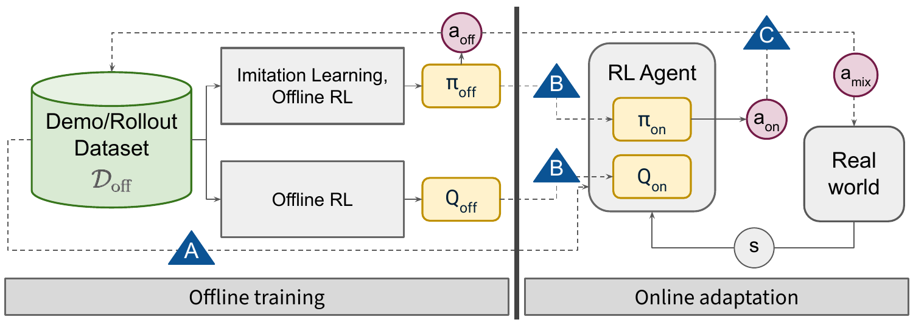

# Rainbow-DemoRL

Rainbow-DemoRL is a modular framework for combining demonstrations with reinforcement learning for robot manipulation. It implements three orthogonal strategies for leveraging demonstrations during online RL training, and supports arbitrary hybrid combinations of these strategies. Built on [ManiSkill](https://github.com/haosulab/ManiSkill) GPU-accelerated environments.



## Three Strategies for Using Demonstrations

| | Flag / keys | Idea |
|---|-------------|------|
| **A: Direct data** | `--use-offline-data-for-rl` (RLPD), `--use-auxiliary-bc-loss` | Prefill buffer with offline trajectories for direct use in online RL update ([RLPD](https://arxiv.org/abs/2302.02948)) and/or add a BC term on the actor. |
| **B: Offline pretrain** | `--pretrained-offline-policy-type`, `--pretrained-offline-value-type` | Train BC / CQL / CalQL / MCQ on HDF5 demos, then finetune online ([CQL](https://arxiv.org/abs/2006.04779), [CalQL](https://arxiv.org/abs/2303.05479)). |
| **C: Action mixing** | `IBRL_*`, `CHEQ_*`, `RESRL_*` | Blend or choose between a frozen **control prior** and the RL policy ([IBRL](https://arxiv.org/abs/2311.02198), [CHEQ](https://arxiv.org/abs/2406.19768), [Residual RL](https://arxiv.org/abs/1812.06298)). |

**WSRL (A+B):** `--offline-buffer-type rollout` — fill the offline buffer with rollouts from the pretrained policy instead of raw demos.

**Beyond the paper:** [ACT](https://arxiv.org/abs/2304.13705) (`ACT`, `ACT_TD3`), [PARL](https://arxiv.org/abs/2412.06685) (`PARL_TD3`, `PARL_SAC`, `PARL_ACT`).

**Base RL:** [TD3](https://arxiv.org/abs/1802.09477), [SAC](https://arxiv.org/abs/1801.01290) — all hybrid variants build on one of these. We recommend using SAC.

## Installation

```bash
git clone https://github.com/dwaitbhatt/Rainbow-DemoRL.git && cd Rainbow-DemoRL
pip install -e .
```

## Training Pipeline

The general workflow has up to three stages. By default we recommend generating demonstrations by training a simple RL expert (SAC or TD3) for roughly 1M environment steps and saving the replay buffer to HDF5. That dataset matches the on-policy distribution you will use during hybrid training. Alternatively, you can use motion-planning trajectories from ManiSkill when you want cheap, task-specific expert data without RL pretraining.

```
  Stage 1: Demonstrations                    Stage 2 (optional):            Stage 3: Online RL
  (pick one source)                         Offline Pretraining
 ┌────────────────────────────┐             ┌──────────────────────┐        ┌──────────────────────────┐
 │ DEFAULT: Train RL expert   │──h5──>      │ BC / CQL / CalQL /   │─.pt──> │ SAC or TD3               │
 │ SAC or TD3, ~1M steps      │             │ MCQ / ACT            │        │ + Strategy A/B/C flags   │
 │ + --save-buffer            │             └──────────────────────┘        └──────────────────────────┘
 └────────────────────────────┘
 ┌────────────────────────────┐
 │ ALTERNATIVE: Motion        │
 │ planning demos             │
 └────────────────────────────┘
```

**Stage 1 -- Default (RL expert demos):** Run pure online RL with `--save-buffer`. The trainer writes trajectories under `demos/<robot>/<env_id>/rl_buffer/<exp_name>/` as ManiSkill-compatible HDF5 (see `TrajReplayBuffer.enable_saving` in the online trainer). Use that file as `--demo-path` for offline training, RLPD, or filtering (e.g. `filter_dataset_by_return.py` for top-X% expert slices).

**Stage 1 -- Alternative (motion planning):** Run `python -m rainbow_demorl.generate_motionplanning_demos` to produce solver-generated trajectories without training an RL policy first.

**Stage 2** (optional, for Strategies B and C) trains an offline policy and/or value function from the HDF5 demonstrations. Produces a `.pt` checkpoint.

**Stage 3** trains the online RL agent, optionally leveraging the pretrained checkpoint (Strategy B), demo data (Strategy A), and/or a control prior for action mixing (Strategy C).

## Quick Start

### 1. Obtain demonstrations

**Recommended - train an RL expert (~1M steps), save the replay buffer, filter best trajectories:**

```bash
python -m rainbow_demorl.train \
    -a SAC \
    -e PickCube-v1 \
    -r xarm6_robotiq \
    --online-learning-timesteps 1000000 \
    --save-buffer \
    --exp-name my_sac_expert_buffer
python rainbow_demorl/utils/filter_dataset_by_return.py -i path/to/trajectory.h5 -p 0.9
```
Adjust `-i` to your actual `.h5` path. Use the filtered file as `--demo-path` for BC, CQL, ACT, RLPD, etc.

**Alternative - motion planning (no RL expert):**

```bash
python -m rainbow_demorl.generate_motionplanning_demos \
    -nt 1000 \
    -e PickCube-v1 \
    -r xarm6_robotiq
```

### 2. Train offline policy / value functions (BC, CQL, ACT, etc.)

```bash
# Simple Behavioral Cloning
python -m rainbow_demorl.train \
    -a BC_DET \
    -e PickCube-v1 \
    -r xarm6_robotiq \
    --demo-path path/to/trajectory.h5

# CQL (offline RL)
python -m rainbow_demorl.train \
    -a CQL \
    --cql_variant cql-rho \
    -e PickCube-v1 \
    -r xarm6_robotiq \
    --demo-path path/to/trajectory.h5

# ACT (offline imitation on the same demonstrations)
python -m rainbow_demorl.train \
    -a ACT \
    -e PickCube-v1 \
    -r xarm6_robotiq \
    --demo-path path/to/trajectory.h5
```

### 3. Train hybrid methods as below

#### Example commands

| Pattern | Command gist |
|---------|----------------|
| Pure online | `-a SAC` |
| RLPD (A) | `-a SAC --use-offline-data-for-rl --offline-buffer-type demos --demo-path ...` |
| BC finetune (B) | `-a SAC --pretrained-offline-policy-type BC_GAUSS --pretrained-offline-policy-path ...` |
| ACT offline + ACT_TD3 (B) | `-a ACT --demo-path ...` then `-a ACT_TD3 --pretrained-offline-policy-type ACT --pretrained-offline-policy-path ... --offline-buffer-type demos --demo-path ...` (same HDF5 for `norm_stats`) |
| RLPD + BC (A+B) | BC path + `--use-offline-data-for-rl --offline-buffer-type demos --demo-path ...` |
| WSRL (A+B) | pretrained policy path + `--use-offline-data-for-rl --offline-buffer-type rollout` |
| IBRL + aux BC (A+C) | `-a IBRL_TD3 --control-prior-path ... --use-auxiliary-bc-loss --offline-buffer-type demos --demo-path ...` |
| CalQL value + CHEQ (B+C) | `-a CHEQ_SAC --pretrained-offline-value-type CALQL --pretrained-offline-value-path ... --control-prior-path ...` |
| RLPD + CQL value + IBRL (A+B+C) | IBRL + `--pretrained-offline-value-type CQL_RHO --pretrained-offline-value-path ...` + RLPD flags + `--demo-path ...` |
| PARL | `-a PARL_TD3` (no control prior); `PARL_ACT` needs `--demo-path` |

Full copy-paste blocks:

```bash
# RLPD
python -m rainbow_demorl.train -a SAC -e PickCube-v1 -r xarm6_robotiq \
  --use-offline-data-for-rl --offline-buffer-type demos --demo-path path/to/trajectory.h5

# ACT_TD3 finetune after offline ACT
python -m rainbow_demorl.train -a ACT_TD3 -e PickCube-v1 -r xarm6_robotiq \
  --pretrained-offline-policy-type ACT --pretrained-offline-policy-path path/to/act.pt \
  --offline-buffer-type demos --demo-path path/to/trajectory.h5
```

## Main CLI flags

| Flag | Alias | Role |
|------|-------|------|
| `--algorithm` | `-a` | Algorithm name (`SAC`, `TD3`, `BC_DET`, `CQL`, `ACT`, `ACT_TD3`, `IBRL_TD3`, …) |
| `--env-id` | `-e` | ManiSkill task |
| `--robot` | `-r` | e.g. `xarm6_robotiq`, `panda` |
| `--online-learning-timesteps` | `-ton` | Online environment interaction steps |
| `--offline-learning-grad-steps` | `-toff` | Offline training steps |
| `--demo-path` | | HDF5 demonstrations |
| `--offline-buffer-type` | | `none` / `demos` / `rollout` |
| `--use-offline-data-for-rl` | | RLPD-style mixing |
| `--use-auxiliary-bc-loss` | | Extra BC on actor |
| `--pretrained-offline-policy-type` / `--pretrained-offline-policy-path` | | Strategy B actor |
| `--pretrained-offline-value-type` / `--pretrained-offline-value-path` | | Strategy B critic |
| `--control-prior-type` / `--control-prior-path` | | Strategy C prior |
| `--save-buffer` | | Save online replay under `demos/` |

`python -m rainbow_demorl.train --help` lists everything (CHEQ, CQL variants, ACT, PARL, etc.).

## Environments

Any registered ManiSkill env (e.g. `PickCube-v1`, `PushCube-v1`, `StackCube-v1`) can be used. We also provide examples of custom variants of PickCube in [`rainbow_demorl/envs/maniskill.py`](rainbow_demorl/envs/maniskill.py).

## License

This project is licensed under the MIT License. See [LICENSE](LICENSE) for details.
